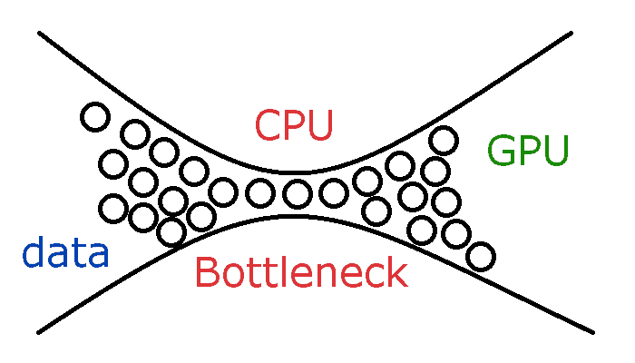
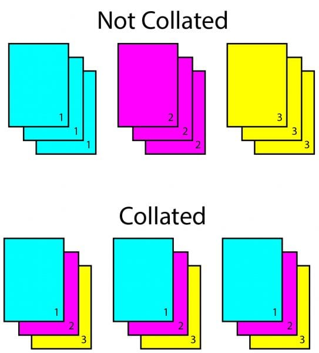

# Custom Dataset 
- DataLoader
    - batch_size
    - shuffle
    - sampler/batch_sampler : index를 control 하는 방법(index를 설정하기 위해 shuffle은 Flase여야 한다.)
      - SequentialSampler : 항상 같은 순서
      - RandomSampler : 랜덤, replacement 여부 선택 가능, 개수 선택 가능
      - SubsetRandomSampler : 랜덤 리스트, 위와 두 조건 불가능
      - WeigthRandomSampler : 가중치에 따른 확률
      - BatchSampler : batch 단위로 sampling 가능
      - DistributedSampler : 분산처리 (torch.nn.parallel.DistributedDataParallel과 함께 사용)
    - num workers : 데이터를 불러올때 사용하는 서브프로세스의 개수
  
  주의사항 : 무작정 num_workers를 높인다고 해서 좋지 않다. CPU와 GPU사이에서 많은 교류가 일어나면 오히려 병목이 생길 수 있다 
    - collate_fn : 데이터 사이즈를 맞추기 위해 사용 -> ((피처1, 라벨1) (피처2, 라벨2))와 같은 배치 단위 데이터가 ((피처1, 피처2), (라벨1, 라벨2))와 같이 바뀝니다.
  
    - pin_memory : True인 경우 Tensor를 CUDA 고정 메모리에 할당
    - drop_last : 마지막 batch의 길이가 다른 경우 loss를 구하기 귀찮아지고, 의존도가 높은 함수인 경우 버림
    - time_out : DataLoader가 data를 불러오는데 제한시간
    - work_init_fn : 어떤 worker를 불러올 것인가
```python
DataLoader(dataset,            # Dataset 인스턴스가 들어감
           batch_size=1,       # 배치 사이즈를 설정
           shuffle=False,      # 데이터를 섞어서 사용하겠는지를 설정
           sampler=None,       # sampler는 index를 컨트롤
           batch_sampler=None, # 위와 비슷하므로 생략
           num_workers=0,      # 데이터를 불러올때 사용하는 서브 프로세스 개수
           collate_fn=None,    # map-style 데이터셋에서 sample list를 batch 단위로 바꾸기 위해 필요한 기능
           pin_memory=False,   # Tensor를 CUDA 고정 메모리에 할당
           drop_last=False,    # 마지막 batch를 사용 여부
           timeout=0,          # data를 불러오는데 제한시간
           worker_init_fn=None # 어떤 worker를 불러올 것인가를 리스트로 전달
          )
```

