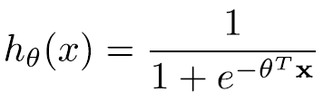
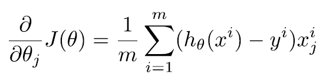
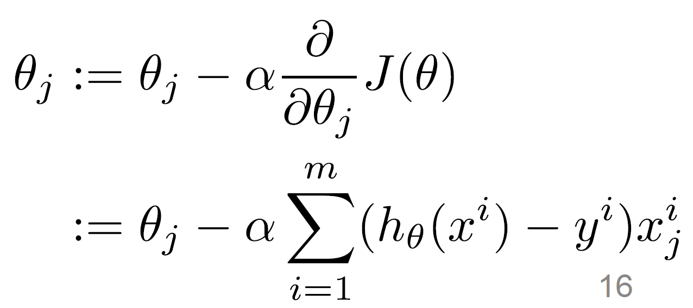
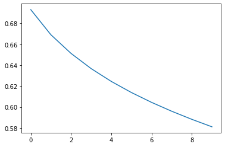

### "Linear Regression" scratch
```python
class LR(nn.Module):
    def __init__(self, dim, lr=torch.scalar_tensor(0.01)):
        super(LR, self).__init__()

        self.w = torch.zeros(dim, 1, dtype = torch.float).to(device)
        self.b = torch.scalar_tensor(0).to(device)
        self.grads = {"dw" : torch.zeros(dim, 1, dtype = torch.float).to(device),
                      "db" : torch.scalar_tensor(0).to(device)}
        self.lr = lr.to(device) 

    def forward(self, x):
        z = torch.mm(self.w.T, x) + self.b
        a = self.sigmoid(z)
        return a

    def sigmoid(self, z):
        return 1/(1+torch.exp(-z))

    def backward(self, x, yhat, y):
        ## compute backward
        self.grads["dw"] = (1 / x.shape[1]) * torch.mm(x, (yhat - y).T)
        self.grads["db"] = (1 / x.shape[1]) * torch.sum(yhat - y)

    def optimize(self):
        ## optimization step
        self.w = self.w - self.lr * self.grads["dw"]
        self.b = self.b - self.lr * self.grads["db"]

```
### Loss Function

```python
def loss(yhat, y):
    m = y.size()[1]
    return -(1/m)*torch.sum(y*torch.log(yhat)) + (1-y) * torch.log(1-yhat)
```
### Backward

```python
    def backward(self, x, yhat, y):
        ## compute backward
        self.grads["dw"] = (1 / x.shape[1]) * torch.mm(x, (yhat - y).T)
        self.grads["db"] = (1 / x.shape[1]) * torch.sum(yhat - y)

```

### Optimizer

```python
    def optimize(self):
        ## optimization step
        self.w = self.w - self.lr * self.grads["dw"]
        self.b = self.b - self.lr * self.grads["db"]
```

# 학습 결과
