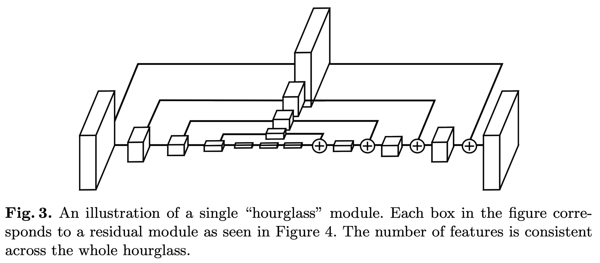
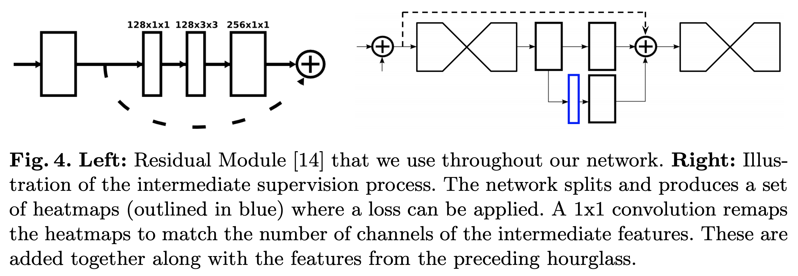

# Landmark Localization (keypoint landmark)

## Hourglass Network

- 자세 추정을 위한 모델 구현
- 입력과 출력의 공간 해상도가 비슷하게 유지되어야 하기 때문에 Unet과 Hourglass network 사용
- Classification을 Regression문제로 치환하는 테크닉
  - Landmark Localization은 대표적인 regression문제이지만 CNN은 classification문제를 더 잘 다루는 경향이 있다.

### 목표
1. Hourglass구조를 쌓을때, 공간 및 채널 차원 수 일치를 고민하여 모델을 설계할 수 있다.
2. Classification문제를 Regression으로 바꾸는 방법을 익힌다.

