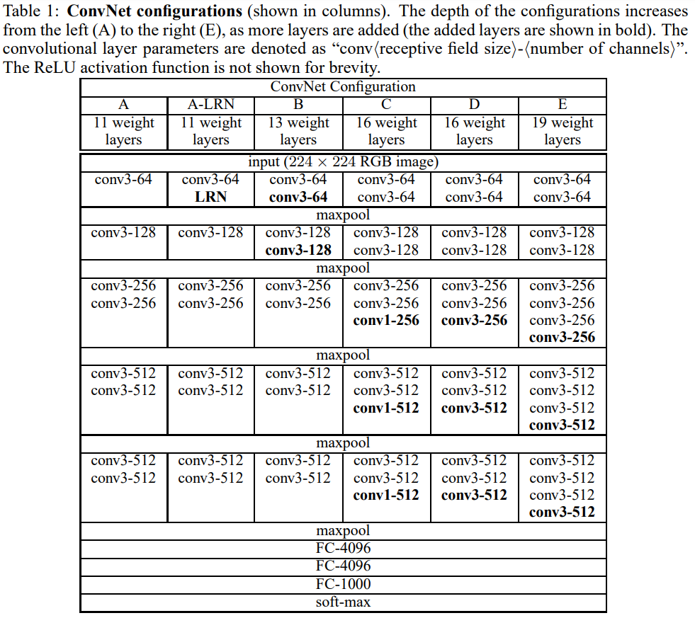
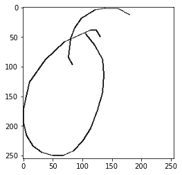

# VGG Implementation and fine-tuning

- VGG 직접 구현
- QuickDraw Dataset
- training from scratch : random weight에서 시작
- VGG-11 pre-trained 모델에서 classification 부분 fine-tuning

목표 : training from scratch 와 fine-tuning을 비교

- Quickdraw dataset 예시 (class:apple)
